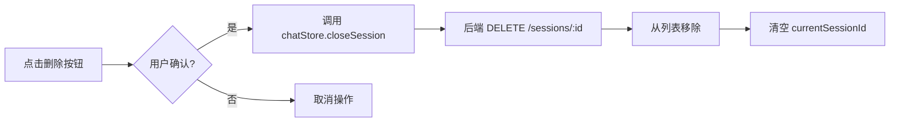

# 第十次提交 - UI优化和功能完善

## 📋 修改总结

本次提交完成了三项UI改进，参考了 `chatgpt-web-main` 的会话管理实现。

---

## ✅ 修改内容

### 1. 添加会话删除功能

**参考代码**：`参考代码/chatgpt-web-main/src/views/chat/layout/sider/List.vue`

**实现位置**：
- 模板（第33-41行）：在活动会话项添加删除按钮
- 函数（第622-631行）：`confirmDeleteSession()` 处理删除逻辑
- 样式（第800-818行）：`.btn-delete-session` 样式

**功能特点**：
- ✅ 删除按钮仅在活动会话显示
- ✅ 使用 `@click.stop` 防止触发会话切换
- ✅ 点击时弹出浏览器原生确认对话框
- ✅ 确认后调用 `chatStore.closeSession(sessionId)`
- ✅ Hover时图标变红色，提供视觉反馈

**代码示例**：
```vue
<button
  v-if="session.session_id === chatStore.currentSessionId"
  class="btn-delete-session"
  @click.stop="confirmDeleteSession(session.session_id)"
  title="删除会话"
>
  🗑️
</button>
```

---

### 2. 修改Agent身份信息

**修改位置**：第341-346行

**变更对比**：
| 字段 | 修改前 | 修改后 |
|------|--------|--------|
| name | 小雨 | 探域智能体 |
| title | 金牌客服 | AI助手 |
| avatar | 真人照片URL | 机器人风格SVG |
| status | 在线 | 在线 |

**头像说明**：
- 使用 DiceBear API 生成的机器人风格头像
- URL: `https://api.dicebear.com/7.x/bottts/svg?seed=tanyu&backgroundColor=0d9488`
- 青色背景（#0d9488）与整体UI配色协调
- SVG格式，清晰且加载快

---

### 3. 删除语音功能

**删除内容**：
1. ✅ 模板中的语音播放按钮（原第92-94行）
   ```vue
   <!-- 已删除 -->
   <button @click="playTts(botMsg)" class="btn-action">
     {{ ttsState[botMsg.id] === 'playing' ? '⏸' : '🔊' }}
   </button>
   ```

2. ✅ TTS状态声明（原第212-214行）
   ```javascript
   // 已删除
   const ttsState = ref({})
   let currentAudio = null
   ```

3. ✅ 完整的 `playTts()` 函数（原第619-647行，共29行）

**保留内容**：
- ✅ 复制按钮（📋）及其功能
- ✅ `copyState` 和 `copyBotText()` 函数

---

## 🎨 额外优化

为适配删除按钮，调整了会话项布局：
- `.session-item` 添加 `position: relative`
- `.session-title` 添加 `padding-right: 32px` 避免文字与按钮重叠

---

## 🧪 测试验收

### 手动测试清单

**会话删除功能**：
- [ ] 点击活动会话，右侧应显示🗑️图标
- [ ] 点击删除按钮，弹出确认对话框
- [ ] 确认后，会话应从列表中移除
- [ ] 如果删除当前唯一会话，列表应显示"暂无会话"

**Agent身份**：
- [ ] Bot消息头像应显示为机器人图标（青色背景）
- [ ] Bot名称应显示为"探域智能体"

**按钮清理**：
- [ ] Bot消息下方应只有一个📋按钮
- [ ] 不应有🔊语音按钮
- [ ] 点击📋应能复制消息内容

---

## 🔧 技术细节

### 删除会话流程



### 头像生成API

DiceBear 参数说明：
- `7.x/bottts`：机器人风格
- `seed=tanyu`：固定种子，确保头像一致
- `backgroundColor=0d9488`：青色背景，匹配主题色

---

## 📚 参考资料

1. **chatgpt-web 会话删除**
   - 文件：`参考代码/chatgpt-web-main/src/views/chat/layout/sider/List.vue`
   - 行号：33-38（删除按钮），90-97（确认对话框）
   - 借鉴：NPopconfirm 弹窗模式（我们使用原生 confirm）

2. **DiceBear API**
   - 文档：https://www.dicebear.com/
   - 样式：bottts（机器人）、avataaars（卡通人）等

---

## 📝 后续建议

1. **删除确认优化**：
   - 可考虑使用 Element Plus 的 ElMessageBox 替代原生 confirm
   - 提供更美观的确认对话框

2. **头像个性化**：
   - 可在用户设置中允许自定义头像样式
   - 保存用户选择的 seed 值

3. **批量操作**：
   - 添加"清空所有会话"功能
   - 会话归档功能

---

生成时间：2026-10-01 23:58
提交哈希：394a8a9
修改文件：customer-service-frontend/src/views/ChatView.vue
