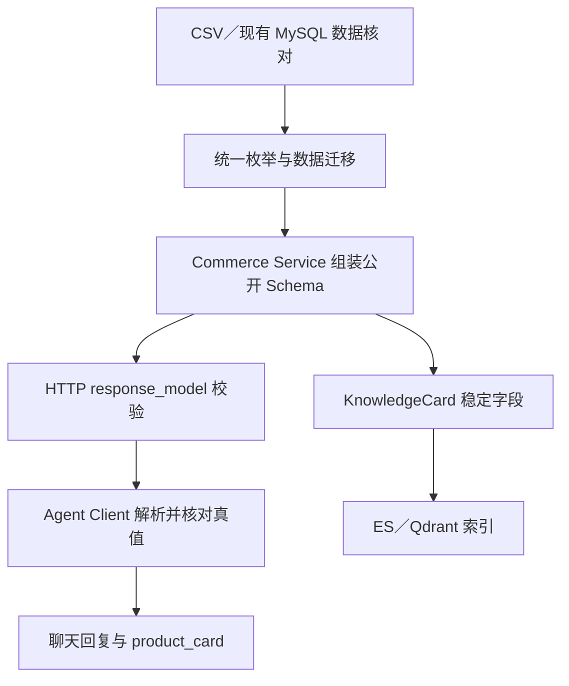

# 问题7修复说明：Commerce 跨服务商品契约与实际数据不一致

**适用范围：**你仓库 `fyvzhu/tanyu_Agent` 的 `main` 提交 `ee3627a`，重点是 Slice01/02 使用的商品列表、商品详情、SKU、商品促销、KnowledgeCard，以及 Agent 对这些接口的读取。以下是给 Codex 的施工说明；我核对了截图、仓库代码、v7 文档和仓库中的 CSV，**尚未连接你本机正在运行的 MySQL**。

## 一、目前的问题究竟是什么

问题并非单纯在 `catalog.py` 中补几个字段。目前至少有五层定义没有完全一致：

| 层次 | 当前情况 | v7 目标或影响 |
|---|---|---|
| **商品详情** | [`ProductDetail`](https://github.com/fyvzhu/tanyu_Agent/blob/ee3627a6177a1af7cb0ad6a1ced2077d88991bcf/ecommerce-service-backend/app/schemas/catalog.py) 有 `master_category/sub_category/type`，但公开详情没有统一的 `category`、`main_image_url`。 | [`07_api_runtime_contract.md`](https://github.com/fyvzhu/tanyu_Agent/blob/ee3627a6177a1af7cb0ad6a1ced2077d88991bcf/%E5%BC%80%E5%8F%91%E6%94%B9%E9%80%A0md%E6%96%87%E6%A1%A3/tanyu_developer_handoff_final_v7/07_api_runtime_contract.md) 要求公开详情提供这两个展示字段。当前内部 KnowledgeCard 路由会临时计算它们，造成两个接口描述同一商品却不一致。 |
| **商品列表** | [`ProductWithDefaultSKU`](https://github.com/fyvzhu/tanyu_Agent/blob/ee3627a6177a1af7cb0ad6a1ced2077d88991bcf/ecommerce-service-backend/app/schemas/catalog.py) 主要返回一个 `default_sku`。 | v7 列表要求 `category/main_image_url/min_price/max_price/has_stock`。一个默认 SKU 不能代表全部 SKU 的价格范围。 |
| **库存状态** | 仓库 `product_skus.csv` 是“有货/缺货”，本次核对共 **564/99** 条；[Repository](https://github.com/fyvzhu/tanyu_Agent/blob/ee3627a6177a1af7cb0ad6a1ced2077d88991bcf/ecommerce-service-backend/app/repositories/product.py) 和订单、换货代码也直接比较“有货”。 | v7 的公开 SKU 和内部 SKU Filter 使用 `in_stock/out_of_stock`。仅改响应，内部筛选仍用旧值，就可能把有货商品过滤掉。 |
| **促销** | CSV 中有 `PERCENT_OFF`、`FIXED_OFF`、`FULL_REDUCTION`、`MEMBER_PRICE` 四类；现有 [`PromotionInfo`](https://github.com/fyvzhu/tanyu_Agent/blob/ee3627a6177a1af7cb0ad6a1ced2077d88991bcf/ecommerce-service-backend/app/schemas/catalog.py) 返回 `promotion_name`，缺公开示例中的 `title/start_at/end_at/applicable`。 | v7 示例使用 `threshold_discount`，但**没有给出四类促销的完整枚举映射**。必须先补全正式契约，再改代码，不能把四类都变成 `threshold_discount`。 |
| **Agent 消费结果** | [`flows/product.py`](https://github.com/fyvzhu/tanyu_Agent/blob/ee3627a6177a1af7cb0ad6a1ced2077d88991bcf/customer-service-backend/customer_service/flows/product.py) 尝试从 SKU 的 `image_url` 取主图，但当前 [`SKUInfo`](https://github.com/fyvzhu/tanyu_Agent/blob/ee3627a6177a1af7cb0ad6a1ced2077d88991bcf/ecommerce-service-backend/app/schemas/catalog.py) 没有这个字段。 | 即便 Commerce 补了正确主图，Agent 不改读取位置，前端商品卡仍可能没有图片。 |

**还有一处很容易让测试误判：v7 示例数据与仓库 CSV 不是同一组真实值。**文档举例把商品 `15970` 写作“女士通勤连衣裙”，将 `SKU15970_02` 写为 `"299.90"`、`"in_stock"`；当前仓库 CSV 中 `15970` 是“Turtle 男士格纹衬衫”，该 SKU 为 `"269.90"`、`"缺货"`。因此，**文档示例用于定义字段形状，不能直接当真实数据库的断言值**。Codex 要么更新示例为一致的隔离 fixture，要么在集成测试中读取实际测试数据库并与 API 对比。

## 二、具体参考哪个 GitHub 项目，借鉴到哪里为止

主要参考 [FastAPI 官方的 full-stack-fastapi-template](https://github.com/fastapi/full-stack-fastapi-template)。它的价值在于明确区分数据模型与公开响应模型，并为 API 字段和权限写测试；官方 FastAPI 文档也明确说明 `response_model` 会用于响应校验、过滤和 OpenAPI 描述。genui{"refs":["turn69search7","turn69search0"]}

让 Codex **定点阅读**：

1. [**`backend/app/models.py`：`Item`、`ItemPublic`、`ItemsPublic`**](https://github.com/fastapi/full-stack-fastapi-template/blob/cb740b656d7a0a6c5e12c7bf8e50343ec94ee9c7/backend/app/models.py)：学习“数据库对象”和“对客户端承诺的字段”分开定义。应用到你的 `Product/ProductSKU/Promotion` 与公开的商品、SKU、促销 Schema。
2. [**`backend/app/api/routes/items.py`：`response_model` 和资源读取**](https://github.com/fastapi/full-stack-fastapi-template/blob/cb740b656d7a0a6c5e12c7bf8e50343ec94ee9c7/backend/app/api/routes/items.py)：学习在路由边界声明明确的响应模型，并在返回前处理数据。应用到你的 [`api/public/catalog.py`](https://github.com/fyvzhu/tanyu_Agent/blob/ee3627a6177a1af7cb0ad6a1ced2077d88991bcf/ecommerce-service-backend/app/api/public/catalog.py)，把核心接口的 `ApiResponse[dict]` 换成具体模型。
3. [**`backend/app/api/deps.py` 与 `backend/tests/api/routes/test_items.py`**](https://github.com/fastapi/full-stack-fastapi-template/blob/cb740b656d7a0a6c5e12c7bf8e50343ec94ee9c7/backend/tests/api/routes/test_items.py)：学习“身份从认证依赖取得”和“用不同用户验证权限”的测试方式。你的促销接口必须根据 **JWT 对应的真实用户等级**过滤，不能相信 Agent 自己传来的会员等级。
4. [**`frontend/openapi-ts.config.ts`**](https://github.com/fastapi/full-stack-fastapi-template/blob/cb740b656d7a0a6c5e12c7bf8e50343ec94ee9c7/frontend/openapi-ts.config.ts)：学习让公开响应进入 OpenAPI/前端类型，而不是只在 Markdown 中写字段。

**参考边界：**不复制该模板的 React 页面、PostgreSQL 表结构或商品业务规则；它没有定义你项目的库存和促销语义。商品字段和业务真值必须由你的 Commerce 数据、v7 文档以及下述明确的契约决策确定。

## 三、建议冻结的一套契约

我建议采用**数据库、导入 CSV、Commerce HTTP、Agent 解析使用同一套正式枚举**，以免长期保留两套名字。v7 已明确库存使用 `in_stock/out_of_stock`；促销则在修订 `07_api_runtime_contract.md` 时补全以下四类。这是**针对当前四种数据的具体修订建议**，其中只有 `threshold_discount` 已出现在现有 v7 示例中：

| 当前 CSV/数据库值 | 建议的最终值 | 必须保留的事实字段 |
|---|---|---|
| `有货` / `缺货` | `in_stock` / `out_of_stock` | SKU ID、价格、颜色、尺码 |
| `PERCENT_OFF` | `percentage_discount` | `discount_rate`；不能把 `0.90`误说成“优惠 90%” |
| `FIXED_OFF` | `fixed_discount` | `discount_amount` |
| `FULL_REDUCTION` | `threshold_discount` | `threshold_amount`、`discount_amount` |
| `MEMBER_PRICE` | `member_price` | `promo_price`、会员适用规则 |

促销公开响应还须有 `promotion_id/title/promotion_type/description/start_at/end_at/applicable`。Commerce 负责活动时间、状态、商品和会员资格的最终判断；对于已经筛选出的适用活动，`applicable=true`。无适用活动是成功响应的 `items=[]`。**不要让 Agent 自己计算会员资格或活动是否生效。**

这里的“统一”意味着不能只写一行 `stock_status` 输出转换。Codex 必须同步检查并修改：[`product.py` 数据模型](https://github.com/fyvzhu/tanyu_Agent/blob/ee3627a6177a1af7cb0ad6a1ced2077d88991bcf/ecommerce-service-backend/app/models/product.py)、CSV/导入脚本、Repository 的库存过滤、[`CatalogService`](https://github.com/fyvzhu/tanyu_Agent/blob/ee3627a6177a1af7cb0ad6a1ced2077d88991bcf/ecommerce-service-backend/app/services/catalog.py)、订单与换货中的库存判断，以及 Agent 的过滤和卡片组装。先检查**实际 MySQL** 中的不同取值，再做可回滚的数据迁移；不能仅凭仓库 CSV 推断线上库的内容。

## 四、具体如何修改代码

以下是**目标写法示意**，供 Codex 按现有工程调整；不是声称这些代码已提交。

**1. 在 Commerce 明确定义公开 Schema，而不是到处使用 `dict` 和任意字符串。**

```python
from decimal import Decimal
from enum import Enum
from pydantic import BaseModel, ConfigDict

class StockStatus(str, Enum):
    IN_STOCK = "in_stock"
    OUT_OF_STOCK = "out_of_stock"

class PromotionType(str, Enum):
    PERCENTAGE_DISCOUNT = "percentage_discount"
    FIXED_DISCOUNT = "fixed_discount"
    THRESHOLD_DISCOUNT = "threshold_discount"
    MEMBER_PRICE = "member_price"

class SkuPublic(BaseModel):
    model_config = ConfigDict(from_attributes=True)
    sku_id: str
    product_id: str
    color: str | None
    size_code: str | None
    price: Decimal
    stock_status: StockStatus

class SkuItems(BaseModel):
    items: list[SkuPublic]
```

随后将公开 SKU 路由改为类似 `response_model=ApiResponse[SkuItems]`。促销也定义 `PromotionPublic` 和 `PromotionItems`，不要继续用 `ApiResponse[dict]` 掩盖缺字段问题。FastAPI 的响应模型可以验证和过滤返回值，OpenAPI 也会反映声明的结构；但它不能代替真实数据测试。genui{"ref":"turn69search0"}

**2. 在 Service 层统一组装商品展示字段。**

[`CatalogService.get_product_detail()`](https://github.com/fyvzhu/tanyu_Agent/blob/ee3627a6177a1af7cb0ad6a1ced2077d88991bcf/ecommerce-service-backend/app/services/catalog.py) 应明确返回 `category`、`main_image_url`。例如，先约定公开的 `category` 是最具体的非空分类：

```python
category = product.type or product.sub_category or product.master_category
main_image_url = f"/static/main-images/{product.product_id}.jpg"
```

商品列表使用同样的规则，避免列表显示“衬衫”、详情却显示“服装”。**搜索条件**仍可匹配 `type/sub_category/master_category` 三层，不应因为展示选了最细分类，就使用户按“服装”搜索不到衬衫。主图 URL 还要以实际静态文件 HTTP 可访问为验收条件，不能只生成一个看似正确的字符串。

列表的 `min_price/max_price` 从相关 SKU 的 `Decimal` 价格求出，序列化为两位小数；`has_stock` 从库存状态求出。不能以第一条 SKU 的价格充当整个商品的价格区间，也不能把没有 SKU 的商品价格写成 `0`。

**3. 促销从真实记录构造公开结果，并保持授权边界。**

在 [`get_active_promotions()`](https://github.com/fyvzhu/tanyu_Agent/blob/ee3627a6177a1af7cb0ad6a1ced2077d88991bcf/ecommerce-service-backend/app/services/catalog.py) 返回对象时，将 `promotion_name` 明确映射为 `title`，带上 `start_at/end_at` 和该类型必需的优惠参数。公开的 [`GET /api/v1/catalog/products/{product_id}/promotions`](https://github.com/fyvzhu/tanyu_Agent/blob/ee3627a6177a1af7cb0ad6a1ced2077d88991bcf/ecommerce-service-backend/app/api/public/catalog.py) 继续使用 `get_current_user` 从 JWT 找真实用户，再过滤会员活动。

Agent 的 [`promotion_query.py`](https://github.com/fyvzhu/tanyu_Agent/blob/ee3627a6177a1af7cb0ad6a1ced2077d88991bcf/customer-service-backend/customer_service/tools/promotion_query.py) 还需要核对一个具体边界：当前它将 `context.runtime.user_access_token` 直接传给期望 `str` 的 Commerce 客户端；应在受控调用处取出实际 token 值，正确生成 Bearer 头，且不要把 token 写入日志、状态或 ToolResult。

**4. Agent 按 Commerce 最终返回值组装商品卡。**

修改 [`flows/product.py`](https://github.com/fyvzhu/tanyu_Agent/blob/ee3627a6177a1af7cb0ad6a1ced2077d88991bcf/customer-service-backend/customer_service/flows/product.py)：商品卡主图读取 `product["main_image_url"]`，而非 SKU 不存在的 `image_url`；价格和库存取本次 Commerce 返回的 SKU 真值。[`KnowledgeCard`](https://github.com/fyvzhu/tanyu_Agent/blob/ee3627a6177a1af7cb0ad6a1ced2077d88991bcf/ecommerce-service-backend/app/schemas/internal.py) 只保留适合索引的稳定商品事实，**不把当前价格、库存和会员促销写成长期索引真值**。

建议的数据流是：



## 五、怎么测试，怎样才算修好

**测试分三层，且每层都要有失败用例：**

1. **数据迁移与模型测试。**在隔离数据库核对迁移前后的 SKU、促销、订单关联数量；检查 `SELECT DISTINCT stock_status` 只剩两个最终值，`promotion_type` 只剩四个最终值，未知旧值应使迁移或导入明确报错。测试订单购买、换货库存判断仍正确。仓库 CSV 的 564/99 只是本次静态核对结果，实际断言以隔离 MySQL 导入后的数据为准。
2. **Commerce 真实 HTTP 契约测试。**在 Docker MySQL 导入测试数据后，分别请求商品列表、`15970` 详情、SKU 列表、`POST /internal/v1/skus/filter` 和该商品的促销接口。比较响应 `data` 与数据库行；验证金额保留两位小数、图片路径实际可访问、同一筛选条件不会列表显示有货而 SKU Filter 返回空。对不存在商品、无 JWT、过期活动、普通用户访问 PLUS 活动、无活动商品分别断言 404、认证失败或正确的 `items=[]`。再核对 OpenAPI 中这些核心响应不再只是无约束 `dict`。
3. **Agent 跨服务测试。**登录取得真实用户 JWT，调用真实 Commerce 和 Agent，而非只 Mock `CatalogService`。用已知商品问名称、价格、库存、促销；比较聊天文字和 `product_card` 与本轮 Commerce 返回值。更改隔离库中一个 SKU 的价格或库存后重新提问，结果必须反映新值，不能引用旧索引中的动态信息。

Codex 可在项目现有 `test/` 下增加例如 `test/contract/test_catalog_contract.py`、`test/contract/test_promotion_contract.py` 和相应跨服务 E2E。参考上游 [`test_items.py`](https://github.com/fastapi/full-stack-fastapi-template/blob/cb740b656d7a0a6c5e12c7bf8e50343ec94ee9c7/backend/tests/api/routes/test_items.py) 的方式，对每个 HTTP 响应写字段和权限的**明确断言**；不能只检查 `status_code == 200` 或打印聊天结果。

**判定成功：**数据、Commerce 四类接口、OpenAPI、Agent 解析和聊天卡片使用同一套已记录的字段与枚举；全部正常和反例测试通过；真实 MySQL 数据与 HTTP 返回一致；会员活动不泄漏；商品主图可访问；修改 SKU 真值后 Agent 回复同步变化。

**判定失败：**只修改 Markdown 或 Pydantic Schema；某条链路还使用“有货/缺货”却向另一条链路发送 `in_stock/out_of_stock`；SKU Filter 错误地返回空；四种促销被压成一种；普通用户看到 PLUS 活动；`product_card` 图片为 `null` 而实际商品有主图；或 E2E 仅靠 Mock、日志输出声称“通过”。上述任一项存在，问题7就还没有解决。

---

## 六、补充确认：按 product_id 关联项目 data 图片，并展示到前端

**本节是用户对商品图片实现方式的明确要求。**商品主图就在项目根目录 `data/main_images/`，尺码图就在 `data/size_images/`。文件名以商品 `product_id` 命名、扩展名为 `.jpg`；例如 `product_id=15970` 对应 `data/main_images/15970.jpg` 与存在时的 `data/size_images/15970.jpg`。图片只以这个确定性的文件规则关联商品，**不新增图片数据库表、对象存储服务、图片容器、SeaweedFS，也不要求把图片上传到其他存储**。

项目 Commerce 已在 [`ecommerce-service-backend/app/app.py`](https://github.com/fyvzhu/tanyu_Agent/blob/ee3627a6177a1af7cb0ad6a1ced2077d88991bcf/ecommerce-service-backend/app/app.py) 挂载 `/static/main-images` 与 `/static/size-images`，v7 [Slice02 的 Static Images](https://github.com/fyvzhu/tanyu_Agent/blob/ee3627a6177a1af7cb0ad6a1ced2077d88991bcf/%E5%BC%80%E5%8F%91%E6%94%B9%E9%80%A0md%E6%96%87%E6%A1%A3/tanyu_developer_handoff_final_v7/02_slice_product_promotion_conversion.md) 也规定 `/static/main-images/{product_id}.jpg`、`/static/size-images/{product_id}.jpg`。Codex 只需补齐现有链路，避免将图片路径错误地从 SKU、KnowledgeCard 索引或新存储中推断。

```text
项目根目录 data/main_images/15970.jpg
  → Commerce StaticFiles: GET /static/main-images/15970.jpg
  → 商品列表／详情的 main_image_url
  → Agent FlowResult 中的 product_card.main_image_url
  → customer-service-frontend 的 
```

**具体修改边界：**

1. Commerce 公开商品列表与详情的 `main_image_url` 统一用 `f"/static/main-images/{product_id}.jpg"` 生成；如返回尺码图 URL，则仅在对应图片确实存在时提供 `/static/size-images/{product_id}.jpg`。API 返回的是浏览器可访问的 URL，不能返回 Windows/Linux 磁盘路径。
2. 将 Commerce StaticFiles 的目录改为从代码位置计算出的项目根目录 `data/main_images` 和 `data/size_images`，不要依赖启动命令的工作目录；本地运行与容器运行均须能访问这两个目录。若以后将 Commerce 本身部署到容器，只需把**同一个现有 data 图片目录挂载进 Commerce 容器**，不启动专门的图片容器。
3. Agent 的 `ProductQueryFlow` 对 Exact 和 Discovery 均使用 Commerce 商品对象返回的 `main_image_url` 构造 `product_card`；禁止继续从当前 SKU Schema 不存在的 `image_url` 取图。KnowledgeCard 中允许保留同一稳定 URL 作为商品事实，但价格、库存和会员促销仍从 Commerce 实时读取。
4. 前端如果运行在 `localhost:5173`，相对路径 `/static/main-images/15970.jpg` 默认会请求前端端口。应在前端现有代理中将 `/static` 转发到 Commerce `:8001`，**或**以受配置的 Commerce 基础地址组成图片绝对 URL；选择一种并统一使用，不在前端硬编码开发机路径。

**额外验收：**本次仓库快照中 `products.csv` 的 83 个 `product_id` 与 `data/main_images` 下 83 个 `.jpg` 文件一一对应，`15970.jpg` 存在。Codex 在实际运行环境重查这项对应关系；通过真实 HTTP 请求确认 `GET /static/main-images/15970.jpg` 返回 200 且内容为图片，并在 Commerce 列表、详情、Agent 的商品卡和浏览器页面四处看到同一商品的正确主图。若接口有 URL 但 HTTP 返回 404、前端请求到了错误端口、卡片图片为 `null`，或改成另起图片存储容器，均不算解决。
